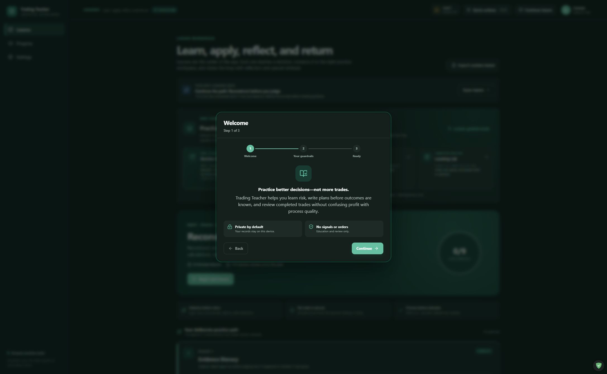
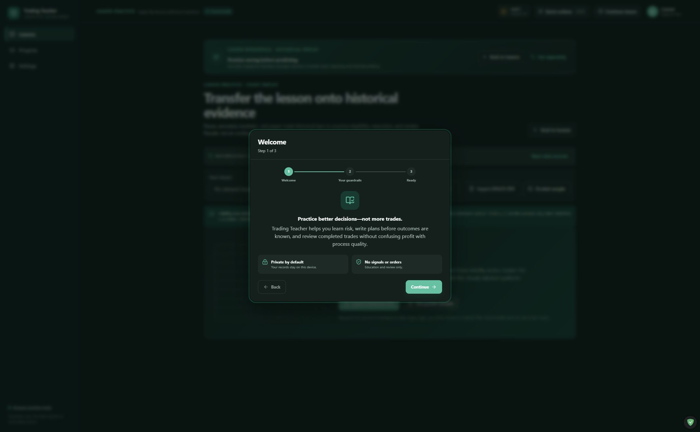
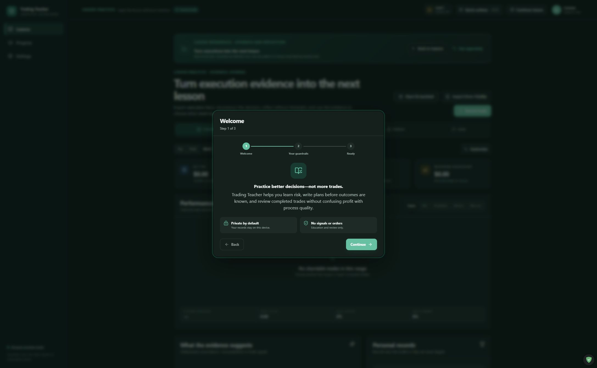
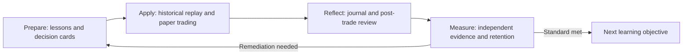

# Day-Trading Teacher

[](https://github.com/NouraldinFarge/day-trading-teacher/actions/workflows/ci.yml)
[](https://github.com/NouraldinFarge/day-trading-teacher/actions/workflows/codeql.yml)
[](https://github.com/NouraldinFarge/day-trading-teacher/releases)
[](LICENSE.md)

**Try it:** [Download the latest verified Windows release](https://github.com/NouraldinFarge/day-trading-teacher/releases/latest) · [Review source](https://github.com/NouraldinFarge/day-trading-teacher) · [Read the educational and financial-safety boundary](SECURITY.md)

**A local-first Windows learning environment for deliberate trading practice, chart replay, paper trading, and evidence-based post-trade review.**

Active development · 2026 · Version 0.32.6

Day-Trading Teacher is built around a simple product decision: teach the process without generating live buy/sell signals. Lessons open contextual planning, replay, journaling, analytics, and practice tools; each activity records reasoning and learning evidence instead of rewarding trade count, profit, or time in market.

> Educational software only. It does not provide investment advice, place orders, or promise trading outcomes.

## Product preview



| Historical replay | Evidence journal |
| --- | --- |
|  |  |



## What it demonstrates

- **Curriculum as product architecture:** ordered Prepare → Apply → Reflect missions connect concepts to planning, replay, and review.
- **Deterministic financial tooling:** Rust crates use decimal arithmetic for risk, expectancy, and lesson-plan validation.
- **Evidence-based mastery:** separate completion from first-try knowledge, unseen-case application, analytic-rubric performance, spaced retention, and remediation.
- **Local-first privacy:** store app state, imports, journals, and provider-specific credentials locally; keep credentials outside normal state exports.
- **Honest integration boundaries:** support manual Fidelity workflows and documented market-data providers without screen scraping, undocumented APIs, account-data access, or order placement.
- **Recoverable portable releases:** validate versioned ZIPs with SHA-256 manifests and preserve local state across activation, upgrade, and explicit downgrade workflows.

## Product highlights

- Nine core lessons plus versioned, schema-validated custom lesson plans.
- Pre-trade Decision Cards covering trigger, risk, execution behavior, exit architecture, time failure, cancellation conditions, and lesson provenance.
- Historical candle and line charts with replay, overlays, measurement, crosshair inspection, zoom, pan, review levels, and focus mode.
- Deterministic risk, expectancy, plan-quality, scenario, and spaced-recall learning labs.
- Paper-trading and journaling workflows designed for reviewable decision quality.
- Fidelity order-history and supported chart-file imports, with explicit limits on what those files can establish.
- Historical OHLCV downloads from Massive, Alpaca, Tradier, or Alpha Vantage using user-supplied credentials.

## Product boundary

- No live buy/sell signals, brokerage credentials, automatic order entry, or account scraping.
- No embedded AI or automatic model calls. ChatGPT may be used outside the app to author a lesson-plan JSON file, which is then validated, previewed, and explicitly approved.
- Market-data feeds remain labeled with their provider and freshness limitations. Downloaded bars are historical learning context, not an execution-quality quote feed.
- Fidelity integration is intentionally manual: the app can open Trader+ and create a ticket checklist, but it never reads Fidelity credentials or places orders.
- A maximum of five provider/symbol/interval series may refresh automatically, and each watch retains its provider identity.

## Architecture

| Layer | Responsibility |
| --- | --- |
| `apps/day-trading-teacher/desktop/src` | React 19 curriculum, planning, charts, journal, labs, and application state |
| `apps/day-trading-teacher/desktop/src-tauri` | Tauri 2 desktop commands, local persistence, imports, and portable runtime |
| `crates/calculations` | Deterministic decimal risk and expectancy calculations |
| `crates/lesson-plan-import` | Schema, safety, provenance, and version validation for imported curricula |
| `content` | Built-in lessons and versioned educational material |
| `build` and `scripts` | Verification, packaging, integrity checks, and activation tooling |

## Run locally

Prerequisites: Windows x64, Node.js/npm, Rust stable MSVC, Microsoft C++ Build Tools, and Microsoft Edge WebView2.

```powershell
npm install
npm run dev
```

Browser development mode uses browser local storage. For the full desktop authority:

```powershell
npm run tauri:dev
```

## Verify

```powershell
npm run verify
```

The verification gate checks formatting, TypeScript, React tests, a production frontend build, Clippy with warnings denied, and the complete Rust workspace test suite.

## Portable release

Double-click `BUILD-LATEST.bat`, or run:

```powershell
.\BUILD-LATEST.ps1
```

The launcher inventories semantic versions across the workspace and release directories, validates registered SHA-256 values, reuses verified ZIPs, and preserves active `data/` and provider configuration. A source build runs every verification gate, compiles the Tauri executable without installer bundling, rejects installer artifacts, creates the portable ZIP, deploys it, and writes a release manifest.

Future version tags are also built on GitHub's Windows runner from the tagged source. That workflow publishes the portable ZIP, SHA-256 checksum, SPDX SBOM, and GitHub artifact-provenance attestation.

For unattended use:

```powershell
.\BUILD-LATEST.ps1 -NonInteractive
```

The portable desktop keeps application-controlled state in `data/state.json` beside the executable and provider credentials in separate ignored `config/market-data-<provider>.json` files.

## Development approach

AI agents assisted with research, implementation, and iteration. Nouraldin Farge retained ownership of product direction, architecture, technical review, testing, curriculum and financial-safety boundaries, source selection, release approval, and published claims. Generated suggestions were treated as untrusted until reviewed against deterministic calculations, schema validation, safety checks, and automated verification.

See [`ROADMAP.md`](ROADMAP.md), [`CONTRIBUTING.md`](CONTRIBUTING.md), and [`SECURITY.md`](SECURITY.md) for current priorities and project policies.

## License

Copyright © 2026 Nouraldin Farge. All rights reserved — see [`LICENSE.md`](LICENSE.md). The repository is available for portfolio review; no permission to copy, modify, or redistribute is granted.
