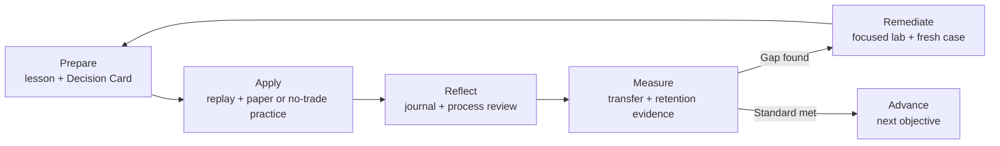

# Day-Trading Teacher

[](https://github.com/NouraldinFarge/day-trading-teacher/actions/workflows/ci.yml)
[](https://github.com/NouraldinFarge/day-trading-teacher/actions/workflows/codeql.yml)
[](https://github.com/NouraldinFarge/day-trading-teacher/releases/latest)
[](https://github.com/NouraldinFarge/day-trading-teacher/releases/latest)
[](LICENSE.md)

> **Practice better decisions—not more trades.**

[](docs/images/day-trading-teacher-social-preview.png)

**A local-first Windows learning environment that connects structured lessons, historical chart replay, paper practice, and evidence-based post-trade review.**

[Download the latest verified release](https://github.com/NouraldinFarge/day-trading-teacher/releases/latest) · [Take the five-minute project tour](#five-minute-project-tour) · [Browse the documentation](docs/README.md) · [Read the safety boundary](SECURITY.md)

Active development · 2026 · Current release **0.32.6**

Day-Trading Teacher teaches the decision process without generating live buy/sell signals. Lessons open the relevant planning, replay, journaling, analytics, and practice workspace; the resulting evidence feeds reflection and spaced practice instead of rewarding trade count, profit, or time in market.

> **Educational software only.** It does not provide investment advice, authenticate to a brokerage, place orders, or promise trading outcomes.

## At a glance

| Area | Current design |
| --- | --- |
| **Learning loop** | Lessons → Decision Card → historical replay or no-trade practice → evidence journal → reflection and spaced retrieval |
| **Desktop stack** | React 19, TypeScript, Tauri 2, and Rust with deterministic decimal calculations |
| **Data model** | Local application state, explicit file imports, user-controlled historical-data providers, and no mandatory cloud account |
| **Broker boundary** | Read-only Fidelity exports and a deliberate manual handoff to Fidelity Trader+ Desktop—never credentials or order placement |
| **Lesson-plan boundary** | Built-in curricula plus schema-validated JSON imports; ChatGPT is optional and remains outside the application |
| **Release model** | Portable Windows ZIP, SHA-256 checksum, SPDX SBOM, immutable release, and build-provenance attestation |

## Product tour

### 1. Learn in context

The default workspace begins with the curriculum. Each lesson explains the decision, names the evidence to produce, and opens only the practice tools that strengthen that objective.

[](docs/images/day-trading-teacher-lessons.png)

### 2. Replay without pretending to predict

The chart supports granular zoom and pan, crosshair inspection, overlays, measurements, drawing tools, replay, transparent backtests, recorded-trade markers, and paper decisions. The pictured `DEMO` series is the app's clearly labeled synthetic practice data—not market data.

[](docs/images/day-trading-teacher-chart.png)

### 3. Turn outcomes into evidence

The Journal separates descriptive performance from process evidence. Progress rewards planning, risk discipline, reflection, correction, and separated practice; rest days and no-trade decisions are never treated as failures.

| Evidence Journal | Learning contribution and achievement view |
| --- | --- |
| [](docs/images/day-trading-teacher-journal.png) | [](docs/images/day-trading-teacher-progress.png) |

Screenshot provenance, privacy rules, and refresh instructions are documented in [`docs/images/README.md`](docs/images/README.md).

## Product boundary by design

| The application does | The application does not |
| --- | --- |
| Teach a nine-lesson core decision chain and versioned imported curricula | Generate live signals, recommendations, or personalized investment advice |
| Calculate risk, expectancy, position size, and descriptive journal analytics deterministically | Promise profitability or treat P&L as proof of decision quality |
| Import supported Fidelity order-history and chart files locally | Read Fidelity credentials, scrape an account, watch the screen, or place an order |
| Download labeled historical OHLCV from configured providers using user-supplied credentials | Present historical bars as an execution-quality quote feed |
| Validate and preview externally authored lesson-plan JSON before explicit approval | Call ChatGPT or any model automatically, or hide an AI runtime inside the app |
| Reward reflection, risk adherence, corrections, no-trade discipline, and spaced practice | Reward trading frequency, position size, screen time, or streak preservation |

## What the engineering demonstrates

| Capability | Implementation evidence |
| --- | --- |
| **Curriculum as product architecture** | Ordered Prepare → Apply → Reflect missions connect concepts to the correct workspace in [`lesson-workspaces.ts`](apps/day-trading-teacher/desktop/src/domain/lesson-workspaces.ts). |
| **Deterministic financial tooling** | Rust-decimal risk and expectancy logic lives in [`crates/calculations`](crates/calculations/src/lib.rs), with a tested browser fallback for development mode. |
| **Untrusted-content boundaries** | Imported curricula pass size, schema, source, skill, URL, active-content, and facilitator-material checks in [`crates/lesson-plan-import`](crates/lesson-plan-import/src/lib.rs). |
| **Evidence-based mastery** | Completion, first-try checks, unseen-case transfer, rubric performance, retention, and remediation remain separate in [`lesson-assessment.ts`](apps/day-trading-teacher/desktop/src/domain/lesson-assessment.ts). |
| **Honest brokerage integration** | Fidelity order reconciliation records confidence, fill counts, quantity basis, unresolved evidence, and duplicates in [`fidelity-import.ts`](apps/day-trading-teacher/desktop/src/domain/fidelity-import.ts). |
| **Local-state defense in depth** | State validation, migration, secret-shaped-field rejection, and export sanitization are covered under [`src/state`](apps/day-trading-teacher/desktop/src/state). |
| **Recoverable portable releases** | Build, verification, checksum registration, activation, rollback, and downgrade behavior are implemented under [`build`](build) and exercised in paths containing spaces. |


```mermaid
flowchart LR
    A["Prepare<br/>lesson + Decision Card"] --> B["Apply<br/>replay + paper or no-trade practice"]
    B --> C["Reflect<br/>journal + process review"]
    C --> D["Measure<br/>transfer + retention evidence"]
    D -->|"Gap found"| E["Remediate<br/>focused lab + fresh case"]
    E --> A
    D -->|"Standard met"| F["Advance<br/>next objective"]
```

## Five-minute project tour

1. **Start with the product decision:** [`docs/development/lesson-first-product-architecture.md`](docs/development/lesson-first-product-architecture.md) explains why Lessons—not tools or trading activity—own the information architecture.
2. **Inspect the learning path:** [`CoreLearningPath.tsx`](apps/day-trading-teacher/desktop/src/features/learning/CoreLearningPath.tsx) renders the six-phase, nine-lesson sequence and its evidence artifacts.
3. **Inspect deterministic boundaries:** [`crates/calculations/src/lib.rs`](crates/calculations/src/lib.rs) and [`crates/lesson-plan-import/src/lib.rs`](crates/lesson-plan-import/src/lib.rs) show the Rust calculation and import authorities.
4. **Inspect the two deepest workspaces:** [`ProfessionalMarketChart.tsx`](apps/day-trading-teacher/desktop/src/features/charting/ProfessionalMarketChart.tsx) and [`JournalDashboard.tsx`](apps/day-trading-teacher/desktop/src/features/trades/JournalDashboard.tsx) connect interaction-heavy practice with reviewable evidence.
5. **Inspect release discipline:** [`.github/workflows/release.yml`](.github/workflows/release.yml) and [`build/build-portable.ps1`](build/build-portable.ps1) build, verify, package, checksum, attest, and publish the portable application.

The [documentation hub](docs/README.md) separates current product documentation from historical implementation records and audit notes.

## Run locally

Prerequisites: Windows x64, Node.js/npm, Rust stable MSVC, Microsoft C++ Build Tools, and Microsoft Edge WebView2.

```powershell
npm ci
npm run dev
```

Browser development mode stores test state in browser local storage. Use the Tauri desktop authority for native persistence, file operations, Fidelity detection, and the portable runtime:

```powershell
npm run tauri:dev
```

## Verify

```powershell
npm run docs:check
npm run verify
```

The complete gate checks repository documentation and media, formatting, TypeScript, React tests, portable deployment behavior, a production frontend build, Clippy with warnings denied, and the complete Rust workspace test suite.

## Build or activate the portable app

Double-click `BUILD-LATEST.bat`, or run:

```powershell
.\BUILD-LATEST.ps1
```

The launcher inventories semantic versions across the workspace, portable builds, active build, and historical source ZIPs; validates registered SHA-256 values; lets the user choose a version; and preserves active `data/` plus provider configuration during activation. A source build runs every verification gate before it creates and deploys the portable ZIP.

For unattended use:

```powershell
.\BUILD-LATEST.ps1 -NonInteractive
```

Tagged GitHub releases publish the Windows ZIP, checksum, SPDX SBOM, and GitHub provenance attestation. Release assets are immutable. See the [latest release](https://github.com/NouraldinFarge/day-trading-teacher/releases/latest) for exact download and verification instructions.

## Repository map

| Path | Purpose |
| --- | --- |
| [`apps/day-trading-teacher/desktop`](apps/day-trading-teacher/desktop) | React interface, Tauri desktop authority, platform bridge, state, and feature modules |
| [`crates`](crates) | Deterministic calculations and lesson-plan import validation |
| [`content`](content) | Built-in, imported, and open-practice educational material |
| [`specs/contracts/schemas`](specs/contracts/schemas) | Versioned JSON contracts for lesson requests and imports |
| [`build`](build) | Portable build, verification, activation, checksum, and deployment tooling |
| [`docs`](docs/README.md) | Current architecture/product documentation plus clearly labeled historical audit records |
| [`.github`](.github) | CI, CodeQL, release automation, dependency updates, and contributor templates |

## Development approach

AI agents assisted with research, implementation, and iteration. Nouraldin Farge retained ownership of product direction, architecture, technical review, testing, curriculum and financial-safety boundaries, source selection, release approval, and published claims. Generated suggestions were treated as untrusted until checked against deterministic calculations, schema validation, safety review, and automated verification.

Focused contributions are welcome through [`CONTRIBUTING.md`](CONTRIBUTING.md). Current priorities and explicit non-goals are in [`ROADMAP.md`](ROADMAP.md); vulnerability reports belong in [GitHub private vulnerability reporting](https://github.com/NouraldinFarge/day-trading-teacher/security/advisories/new).

## License

Copyright © 2026 Nouraldin Farge. All rights reserved—see [`LICENSE.md`](LICENSE.md). The repository is available for portfolio review; no permission to copy, modify, or redistribute is granted.
