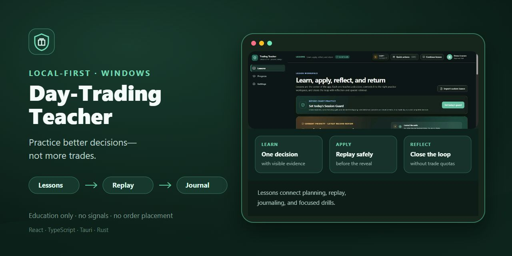
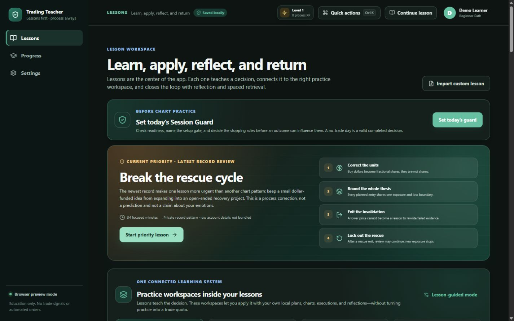
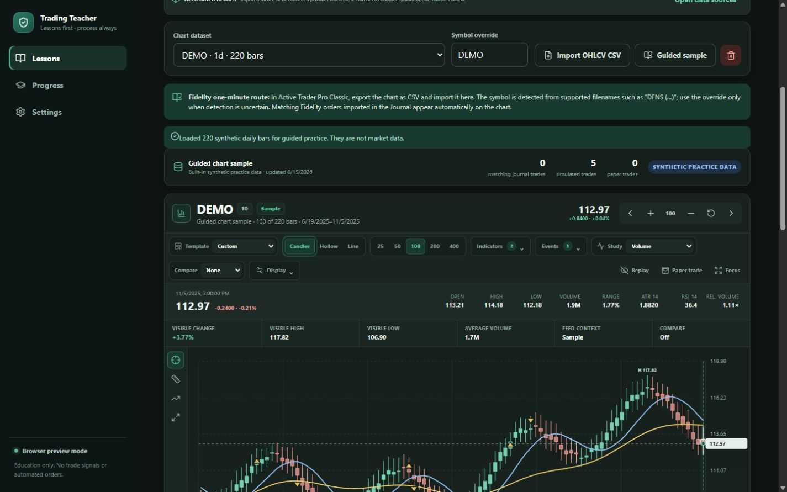
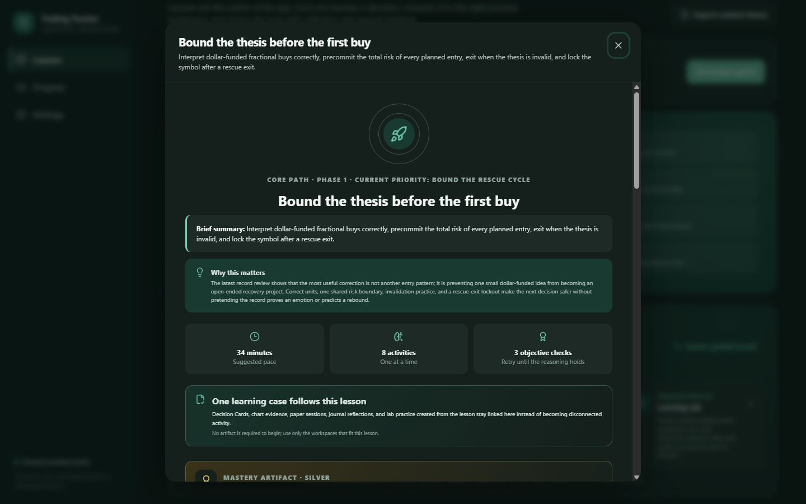
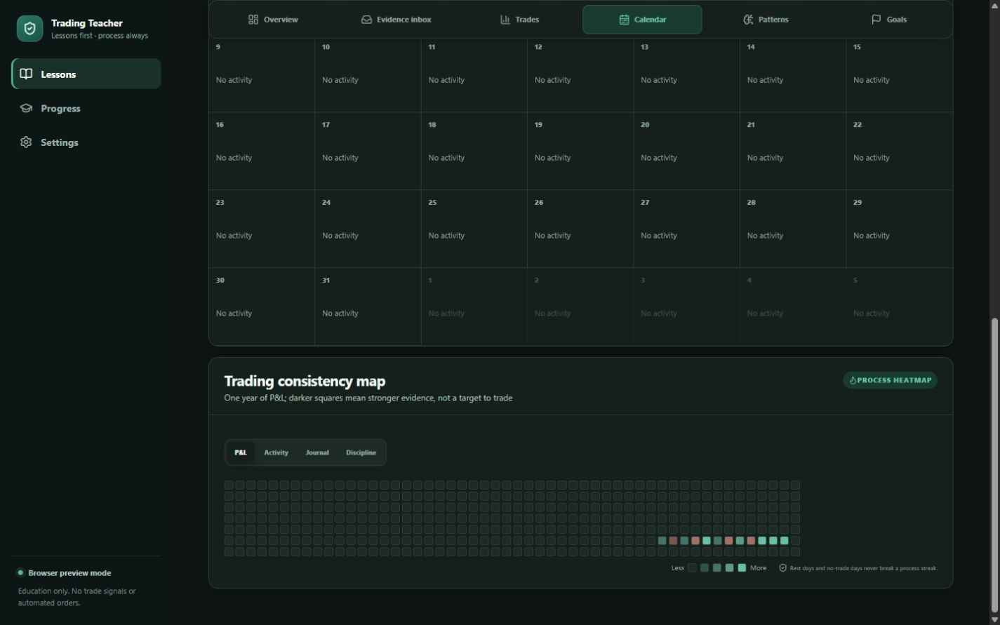
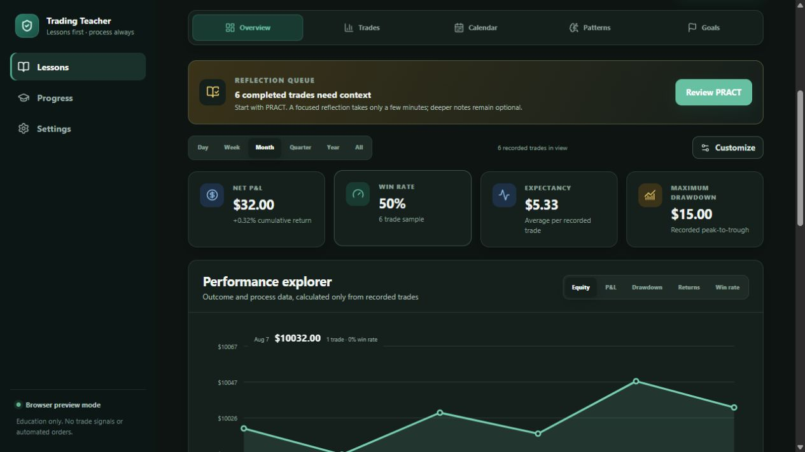
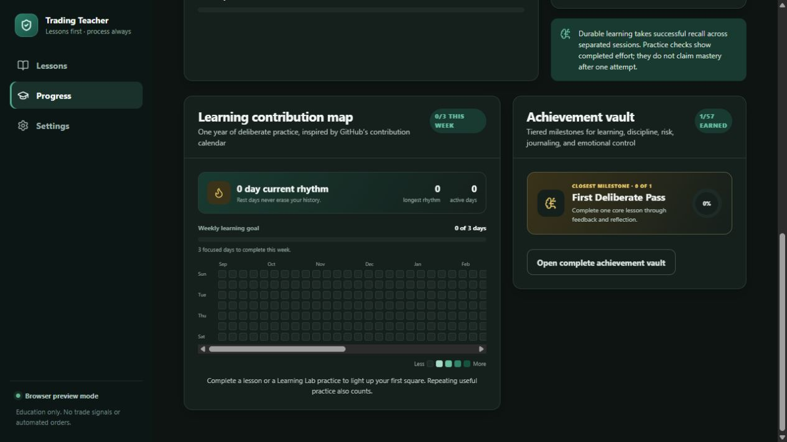
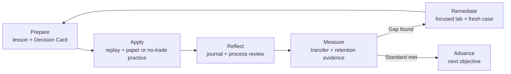

# Day-Trading Teacher

[](https://github.com/NouraldinFarge/day-trading-teacher/actions/workflows/ci.yml)
[](https://github.com/NouraldinFarge/day-trading-teacher/actions/workflows/codeql.yml)
[](https://github.com/NouraldinFarge/day-trading-teacher/actions/workflows/dependency-audit.yml)
[](https://github.com/NouraldinFarge/day-trading-teacher/releases/latest)
[](https://github.com/NouraldinFarge/day-trading-teacher/releases/latest)
[](LICENSE.md)

> **Practice better decisions—not more trades.**

[](docs/images/day-trading-teacher-social-preview.png)

**A local-first Windows learning environment that connects structured lessons, historical chart replay, paper practice, and evidence-based post-trade review.**

[Download the latest verified release](https://github.com/NouraldinFarge/day-trading-teacher/releases/latest) · [View the visual project site](https://nouraldinfarge.github.io/day-trading-teacher/) · [Take the five-minute project tour](#five-minute-project-tour) · [Browse the documentation](docs/README.md) · [Support](SUPPORT.md) · [Privacy](PRIVACY.md) · [Security](SECURITY.md)

Active development · 2026 · Current development version **0.37.0** · Latest public release **v0.36.0**

Day-Trading Teacher teaches the decision process without generating live buy/sell signals. Lessons open the relevant planning, replay, journaling, analytics, and practice workspace; the resulting evidence feeds reflection and spaced practice instead of rewarding trade count, profit, or time in market.

> **Educational software only.** It does not provide investment advice, authenticate to a brokerage, place orders, or promise trading outcomes.

## At a glance

- **Learning loop:** Lessons → Decision Card → historical replay or no-trade practice → evidence journal → reflection and spaced retrieval.
- **Practice boundary:** A persistent Daily Session Guard records readiness, setup eligibility, no-trade choices, and preset paper-trading stop rules before outcomes are known.
- **Desktop stack:** React 19, TypeScript, Tauri 2, and Rust with deterministic decimal calculations.
- **Data model:** Coordinated atomic local state with split high-volume collections, revision-matched recovery, explicit imports, and no mandatory cloud account.
- **Broker boundary:** A read-only Trading Records evidence inbox and deliberate manual handoff to Fidelity Trader+ Desktop—never credentials or order placement.
- **External-AI boundary:** Optional lesson plans and journal drafts use explicit, schema-validated file handoffs; no model runs inside the application and nothing uploads automatically.
- **Trade-derived learning:** Validated journal evidence becomes a newest-to-oldest audit that preserves each original lesson, separates hindsight, connects recurring mechanisms, and produces measurable practice rules.
- **Release model:** Portable Windows ZIP, SHA-256 checksum, SPDX SBOM, third-party license inventory, optional Authenticode verification, immutable release, and build-provenance attestation.

## Product tour

### 1. Learn in context

The default workspace begins with the curriculum. Every core or imported lesson opens with a brief summary and guide, explains why the decision matters, names the evidence to produce, and opens only the practice tools that strengthen that objective. Decision Cards, chart datasets, paper sessions, journal reflections, and lab practice then remain connected under one local learning case.

[](docs/images/day-trading-teacher-lessons.png)

### 2. Replay without pretending to predict

The chart supports pointer-anchored 0.5% zoom, exact one-bar keyboard zoom, independent price-scale control, drag and shift-wheel panning, crosshair inspection, overlays, measurements, drawing tools, replay, transparent backtests, recorded-trade markers, and guarded paper decisions. The pictured `DEMO` series is the app's clearly labeled synthetic practice data—not market data.

[](docs/images/day-trading-teacher-chart.png)

### 3. Turn outcomes into evidence

The Journal separates descriptive performance from process evidence. Its Evidence inbox reads dated Fidelity Orders and chart exports together, reconstructs fractional-dollar positions, pairs exact day/symbol chart context, and can create a redacted package for externally generated journal drafts. Every returned strategy or mental-state claim remains a cited hypothesis until the learner reviews it.

The Trade Lessons workspace then works backward from the newest record. It keeps the original lesson intact, distinguishes what was knowable before the entry from facts learned afterward, audits lesson quality, rewrites the lesson into eight decision-ready parts, and connects repeated mechanisms across older trades. Review status records reflection only; it never implies mastery. Progress rewards planning, risk discipline, reflection, correction, and separated practice; rest days and no-trade decisions are never treated as failures.

#### Guided lesson opening

[](docs/images/day-trading-teacher-lesson.png)

#### Process calendar and contribution heatmap

[](docs/images/day-trading-teacher-calendar.png)

#### Evidence Journal

[](docs/images/day-trading-teacher-journal.png)

#### Achievement evidence detail

[](docs/images/day-trading-teacher-progress.png)

Screenshot provenance, privacy rules, and refresh instructions are documented in [`docs/images/README.md`](docs/images/README.md).

## Product boundary by design

### The application does

- Teach a 13-lesson core decision chain—beginning with a privacy-safe latest-record risk correction—and versioned imported curricula.
- Calculate risk, expectancy, position size, and descriptive journal analytics deterministically.
- Recursively read supported Fidelity order-history and chart files locally, with `Buy 10` interpreted as $10 invested.
- Audit matched records newest-to-oldest, preserve the original lesson, label hindsight, and build rules from repeated evidence.
- Download labeled historical OHLCV from configured providers using user-supplied credentials.
- Validate and preview externally authored lesson plans and evidence-cited journal drafts before explicit approval.
- Reward reflection, risk adherence, corrections, no-trade discipline, and spaced practice.
- Enforce the learner’s preset Daily Session Guard across linked local paper sessions.

### The application does not

- Generate live signals, recommendations, or personalized investment advice.
- Promise profitability or treat P&L as proof of decision quality.
- Read Fidelity credentials, scrape an account, watch the screen, or place an order.
- Invent a missing thesis, infer a diagnosis, assume candle extremes were executable, or score a decision from P&L alone.
- Present historical bars as an execution-quality quote feed.
- Call ChatGPT or any model automatically, upload records silently, diagnose a learner, or hide an AI runtime inside the app.
- Reward trading frequency, position size, screen time, or streak preservation.
- Lock, cancel, or otherwise control an order in Fidelity or another brokerage.

## What the engineering demonstrates

- **Curriculum as product architecture:** Ordered Prepare → Apply → Reflect missions connect concepts to the correct workspace in [`lesson-workspaces.ts`](apps/day-trading-teacher/desktop/src/domain/lesson-workspaces.ts).
- **Deterministic financial tooling:** Rust-decimal risk and expectancy logic lives in [`crates/calculations`](crates/calculations/src/lib.rs), with a tested browser fallback for development mode.
- **Untrusted-content boundaries:** Imported curricula pass size, schema, source, skill, URL, active-content, and facilitator-material checks in [`crates/lesson-plan-import`](crates/lesson-plan-import/src/lib.rs).
- **Evidence-based mastery:** Completion, first-try checks, unseen-case transfer, rubric performance, retention, and remediation remain separate in [`lesson-assessment.ts`](apps/day-trading-teacher/desktop/src/domain/lesson-assessment.ts).
- **Process-first practice limits:** Readiness, no-trade, study-only, and automatic review-only transitions are deterministic and tested in [`daily-session.ts`](apps/day-trading-teacher/desktop/src/domain/daily-session.ts).
- **Honest brokerage integration:** The inbox inventories dated Orders and chart exports, reconstructs positions, pairs one-minute context, and preserves unresolved evidence in [`trading-records.ts`](apps/day-trading-teacher/desktop/src/domain/trading-records.ts).
- **Reviewable AI handoff:** Redacted evidence packages, strict response validation, evidence citations, non-diagnostic mental-state limits, and draft-only merging live in [`ai-journal.ts`](apps/day-trading-teacher/desktop/src/domain/ai-journal.ts).
- **Cross-trade learning synthesis:** Temporal evidence separation, per-trade lesson audits, recurring-pattern detection, bounded rules, and Markdown reporting live in [`trade-learning.ts`](apps/day-trading-teacher/desktop/src/domain/trade-learning.ts).
- **Local-state defense in depth:** State validation, migration, secret-shaped-field rejection, and export sanitization are covered under [`src/state`](apps/day-trading-teacher/desktop/src/state).
- **Recoverable portable releases:** Build, verification, checksum registration, activation, rollback, and downgrade behavior are implemented under [`build`](build) and exercised in paths containing spaces.


```mermaid
flowchart LR
    A["Prepare<br/>lesson + Decision Card"] --> B["Apply<br/>replay + paper or no-trade practice"]
    B --> C["Reflect<br/>journal + process review"]
    C --> D["Measure<br/>transfer + retention evidence"]
    D -->|"Gap found"| E["Remediate<br/>focused lab + fresh case"]
    E --> A
    D -->|"Standard met"| F["Advance<br/>next objective"]
```

## Five-minute project tour

1. **Start with the product decision:** [`docs/development/lesson-first-product-architecture.md`](docs/development/lesson-first-product-architecture.md) explains why Lessons—not tools or trading activity—own the information architecture.
2. **Inspect the learning path:** [`CurrentRecordFocus.tsx`](apps/day-trading-teacher/desktop/src/features/learning/CurrentRecordFocus.tsx) opens the newest private record-derived correction, [`TradeLessonsPage.tsx`](apps/day-trading-teacher/desktop/src/features/learning/TradeLessonsPage.tsx) renders the evidence audit and focus plan, and [`CoreLearningPath.tsx`](apps/day-trading-teacher/desktop/src/features/learning/CoreLearningPath.tsx) renders the eight-phase, 13-lesson sequence and its evidence artifacts.
3. **Inspect deterministic boundaries:** [`crates/calculations/src/lib.rs`](crates/calculations/src/lib.rs) and [`crates/lesson-plan-import/src/lib.rs`](crates/lesson-plan-import/src/lib.rs) show the Rust calculation and import authorities.
4. **Inspect the two deepest workspaces:** [`ProfessionalMarketChart.tsx`](apps/day-trading-teacher/desktop/src/features/charting/ProfessionalMarketChart.tsx) and [`JournalDashboard.tsx`](apps/day-trading-teacher/desktop/src/features/trades/JournalDashboard.tsx) connect interaction-heavy practice with reviewable evidence.
5. **Inspect release discipline:** [`.github/workflows/release.yml`](.github/workflows/release.yml) and [`build/build-portable.ps1`](build/build-portable.ps1) build, verify, package, checksum, attest, and publish the portable application.

The [documentation hub](docs/README.md) separates current product documentation from historical implementation records and audit notes.

## Run locally

Prerequisites: Windows x64, Node.js/npm, Rust stable MSVC, Microsoft C++ Build Tools, and Microsoft Edge WebView2.

```powershell
npm ci
npm run dev
```

Browser development mode stores test state in browser local storage. Use the Tauri desktop authority for native persistence, file operations, Fidelity detection, and the portable runtime:

```powershell
npm run tauri:dev
```

## Verify

```powershell
npm run docs:check
npm run verify
npm run e2e
```

The native release gate checks documentation and media integrity, formatting, lint, public-data privacy, production dependencies, TypeScript, coverage thresholds, portable deployment and rollback, production bundle budgets, Clippy with warnings denied, and the complete Rust workspace. The separate Playwright run exercises onboarding, keyboard and screen-reader semantics, lesson-to-chart boundaries, responsive layouts, and the non-persistence of fictional Journal previews in desktop and compact Chromium; CI runs both gates.

## Build or activate the portable app

Double-click `BUILD-LATEST.bat`, or run:

```powershell
.\BUILD-LATEST.ps1
```

The launcher inventories semantic versions across the workspace, portable builds, active build, and historical source ZIPs; validates registered SHA-256 values; lets the user choose a version; and preserves active `data/` plus provider configuration during activation. A source build runs every verification gate before it creates and deploys the portable ZIP.

For unattended use:

```powershell
.\BUILD-LATEST.ps1 -NonInteractive
```

Tagged GitHub releases publish the Windows ZIP, checksum, SPDX SBOM, and GitHub provenance attestation. Release assets are immutable. See the [latest release](https://github.com/NouraldinFarge/day-trading-teacher/releases/latest) for exact download and verification instructions.

## Repository map

| Path | Purpose |
| --- | --- |
| [`apps/day-trading-teacher/desktop`](apps/day-trading-teacher/desktop) | React interface, Tauri desktop authority, platform bridge, state, and feature modules |
| [`crates`](crates) | Deterministic calculations and lesson-plan import validation |
| [`content`](content) | Built-in, imported, and open-practice educational material |
| [`specs/contracts/schemas`](specs/contracts/schemas) | Versioned JSON contracts for lesson requests and imports |
| [`build`](build) | Portable build, verification, activation, checksum, and deployment tooling |
| [`docs`](docs/README.md) | Current architecture/product documentation plus clearly labeled historical audit records |
| [`.github`](.github) | CI, CodeQL, release automation, dependency updates, and contributor templates |

## Development approach

AI agents assisted with research, implementation, and iteration. Nouraldin Farge retained ownership of product direction, architecture, technical review, testing, curriculum and financial-safety boundaries, source selection, release approval, and published claims. Generated suggestions were treated as untrusted until checked against deterministic calculations, schema validation, safety review, and automated verification.

Focused contributions are welcome through [`CONTRIBUTING.md`](CONTRIBUTING.md). Current priorities and explicit non-goals are in [`ROADMAP.md`](ROADMAP.md); vulnerability reports belong in [GitHub private vulnerability reporting](https://github.com/NouraldinFarge/day-trading-teacher/security/advisories/new).

## License

Copyright © 2026 Nouraldin Farge. All rights reserved—see [`LICENSE.md`](LICENSE.md). The repository is available for portfolio review; no permission to copy, modify, or redistribute is granted.

Third-party components remain under their respective licenses; see [`THIRD_PARTY_NOTICES.md`](THIRD_PARTY_NOTICES.md) and the release SBOM. Fidelity, Trader+, TradingView, and other third-party names belong to their respective owners; see [`TRADEMARKS.md`](TRADEMARKS.md). Local-data handling and the public-release boundary are described in [`PRIVACY.md`](PRIVACY.md).
