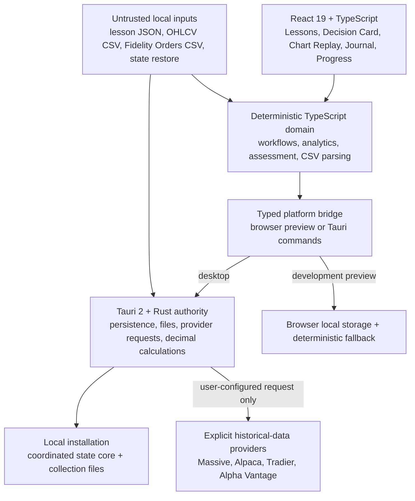

# Architecture overview

Day-Trading Teacher is a local-first Windows desktop application with a lesson-first React interface, a Tauri/Rust desktop authority, deterministic domain modules, inert curriculum files, and a verified portable-release pipeline. The application is educational and descriptive: it does not authenticate to brokerages, generate live signals, or place orders.

## Runtime shape

## Layer responsibilities

| Layer | Location | Responsibility |
| --- | --- | --- |
| Application shell and features | [`apps/day-trading-teacher/desktop/src`](../../apps/day-trading-teacher/desktop/src) | Lesson-first navigation, accessible UI, charts, planning, journal, progress, settings, and local workflow orchestration |
| Domain modules | [`src/domain`](../../apps/day-trading-teacher/desktop/src/domain) | Pure or bounded calculations, CSV parsing, lesson contracts, assessment, achievements, analytics, newest-to-oldest trade-learning synthesis, workflow, and provider normalization |
| State boundary | [`src/state`](../../apps/day-trading-teacher/desktop/src/state) | Validation, migration, persistence coordination, secret-shaped-field rejection, export sanitization, and context updates |
| Platform bridge | [`src/platform/bridge.ts`](../../apps/day-trading-teacher/desktop/src/platform/bridge.ts) | Typed split between browser development behavior and native Tauri authority |
| Desktop authority | [`src-tauri`](../../apps/day-trading-teacher/desktop/src-tauri) | Local files, state, export/restore, credential separation, provider requests, Fidelity discovery, and portable runtime behavior |
| Decimal calculations | [`crates/calculations`](../../crates/calculations) | Validated risk, position-size, result, R-multiple, and expectancy calculations using decimal arithmetic |
| Lesson import authority | [`crates/lesson-plan-import`](../../crates/lesson-plan-import) | Input-size, schema, source, skill, safety, active-content, URL, and facilitator-material validation |
| Curriculum and contracts | [`content`](../../content) and [`specs/contracts/schemas`](../../specs/contracts/schemas) | Inert, versioned lesson data, open-practice resources, templates, and JSON contracts |
| Release operations | [`build`](../../build), [`BUILD-LATEST.ps1`](../../BUILD-LATEST.ps1), and [`.github/workflows`](../../.github/workflows) | Verification, portable packaging, checksum registration, activation, rollback, SBOM, provenance, and immutable release publication |

## Trust boundaries

### Imported files are data, never code

Lesson plans, Fidelity Orders exports, chart CSVs, and state restores are untrusted. Lesson imports are bounded before parsing and rejected for active content, executable or local-file URLs, unknown skills, duplicate identities, and facilitator-only answer or scoring material. CSV imports retain normalized facts and provenance rather than raw account rows.

### Desktop Rust owns authority

The React layer requests operations through a typed bridge. In the installed application, Rust owns persistence, file dialogs, native discovery, historical-provider requests, and authoritative decimal calculations. Browser mode exists for interface development; it is not the production security boundary and is labeled visibly.

### Credentials are separated from normal state

Provider credentials are stored as provider-specific entries in Windows Credential Manager for the current Windows user and excluded from application-state exports. On first successful access, a valid legacy plaintext credential is migrated into the protected store and its old primary, temporary, and backup files are removed. State restore rejects secret-shaped extension fields, while export sanitization removes such fields defensively. Fidelity credentials are never requested or stored.

### AI remains outside the runtime

The app has no model SDK, prompt service, agent loop, or automatic ChatGPT call. A learner may export a privacy-safe request, ask an external AI for either a lesson-plan JSON file or evidence-cited journal drafts, and import the result only after local validation and preview. Journal handoff packages contain sanitized order facts, calculated chart context, explicit unknowns, and no account identifiers or absolute paths. Returned mental-state language is accepted only as a non-diagnostic, confidence-rated hypothesis; it remains incomplete until the learner reviews it.

Setup Playbooks are also local learning data. They preserve versionable, practice-only hypotheses and cannot certify a strategy, produce a signal, or authorize a brokerage action. Context Reading uses synthetic, outcome-hidden cases and grades the evidence workflow—plan, wait, or no trade—rather than the direction of the next bar.

Validated journal drafts can produce a local Trade Lessons system. The deterministic synthesis preserves each original lesson, separates before-entry, entry, during-trade, afterward, and missing evidence, and links repeated mechanisms across older records. It does not call a model, diagnose mental state, fill in a missing plan, or grade the original decision from P&L. Learner review of an audit remains distinct from journal completion and lesson mastery.

## Core product flow

1. **Prepare:** opening a core, imported, or trade-assigned lesson creates a canonical learning case; the lesson establishes the decision, and the Daily Session Guard records readiness, setup eligibility, and preset paper-practice stop rules before any outcome is visible.
2. **Apply:** the learner works with historical, synthetic, paper, or no-trade evidence; compatible Decision Cards, chart datasets, paper sessions, Journal reviews, and Learning Lab practices link back to the same case, and current-market prediction is not required.
3. **Reflect:** completed executions or practice artifacts enter the Journal for factual reconstruction, tail/outlier stress testing, and process review; matched external journal evidence can also enter Trade Lessons for a preserved, newest-to-oldest lesson audit.
4. **Measure:** the system keeps completion, objective-check performance, transfer, rubric evidence, retention, and remediation distinct.
5. **Return:** a gap selects a focused practice route; a met standard advances the objective without turning frequency or P&L into a quota.

## Persistence and portable layout

The portable application keeps app-controlled state under `data/` beside the executable and non-secret provider configuration under `config/`. The native authority separates bulky trades, chart datasets, paper sessions, imported curricula, daily sessions, and trade-learning evidence into individually bounded collection files. `state.json` keeps the compact core plus one revision manifest. Every collection and core write is atomic and retains a matching recovery copy; loading accepts a revision only when the core and every declared collection agree, so a partially interrupted save falls back as one coordinated recovery point. Older monolithic `state.json` files load normally and are partitioned on the next successful save.

Provider credentials remain in Windows Credential Manager and therefore survive verified application-folder upgrades for the same Windows user without being copied into the portable package. Activation preserves `data/` and `config/` across verified upgrades and explicit downgrades. Historical versions remain immutable ZIP files; only the selected release is extracted into the root-level `active-build/` directory.

The one-click launcher inventories the workspace, historical source ZIPs, portable ZIPs, and active build; verifies registered hashes; and builds or activates the selected semantic version. Source builds run the complete verification gate before packaging.

## Current scope and deliberate limits

The Fidelity evidence inbox recursively inventories supported Orders and chart CSVs in dated folders, reconstructs completed equity positions from multiple entry fills and partial exits, applies Fidelity's fractional-dollar buy semantics, pairs same-day one-minute charts by date and symbol, records reconciliation confidence, flags unresolved evidence, and ignores account identifiers. It can detect a root-level `Trading_Records/` directory beside an active portable build. While the Journal remains open, a metadata-only revision probe runs before each polling cycle; unchanged folders are not reread in full, and changed file revisions are reported explicitly. It does not yet claim full brokerage-ledger fidelity for options, multi-leg positions, corporate actions, short-borrow state, or position flips.

Chart data may come from supported CSVs, a clearly labeled synthetic sample, or configured historical-data providers. It remains historical learning context, not a consolidated live quote feed. Backtests expose their assumptions and limitations and are never forecasts.

The Daily Session Guard is a local educational control, not a brokerage control. It links only to the app's paper sessions, moves them to review-only for new simulated entries after a preset loss, trade-count, or consecutive-loss boundary, and preserves position-closing and review actions. It cannot lock or alter Fidelity Trader+ Desktop or any external account.

## Verification model

`npm run verify` runs the documentation/media contract, formatting and lint checks, the public-data privacy scan, the production dependency audit, TypeScript checks, coverage thresholds, portable-deployment rollback tests, the production frontend build and bundle budgets, Clippy with warnings denied, and Rust workspace tests. `npm run e2e` separately exercises desktop and compact browser journeys with serious/critical accessibility scanning; CI runs both gates. Tagged releases repeat the portable build on GitHub's Windows runner and publish a checksum, SPDX SBOM, and build-provenance attestation.

Return to the [documentation hub](../README.md) or take the [five-minute source tour](../../README.md#five-minute-project-tour).
