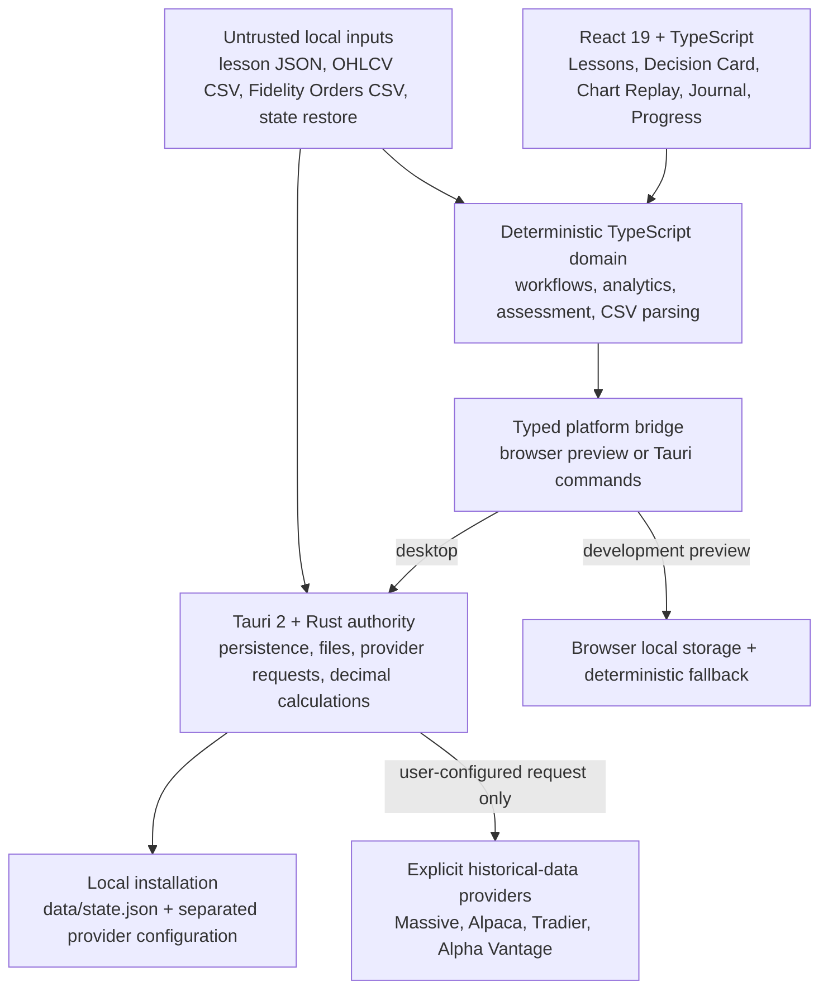

# Architecture overview

Day-Trading Teacher is a local-first Windows desktop application with a lesson-first React interface, a Tauri/Rust desktop authority, deterministic domain modules, inert curriculum files, and a verified portable-release pipeline. The application is educational and descriptive: it does not authenticate to brokerages, generate live signals, or place orders.

## Runtime shape

## Layer responsibilities

| Layer | Location | Responsibility |
| --- | --- | --- |
| Application shell and features | [`apps/day-trading-teacher/desktop/src`](../../apps/day-trading-teacher/desktop/src) | Lesson-first navigation, accessible UI, charts, planning, journal, progress, settings, and local workflow orchestration |
| Domain modules | [`src/domain`](../../apps/day-trading-teacher/desktop/src/domain) | Pure or bounded calculations, CSV parsing, lesson contracts, assessment, achievements, analytics, workflow, and provider normalization |
| State boundary | [`src/state`](../../apps/day-trading-teacher/desktop/src/state) | Validation, migration, persistence coordination, secret-shaped-field rejection, export sanitization, and context updates |
| Platform bridge | [`src/platform/bridge.ts`](../../apps/day-trading-teacher/desktop/src/platform/bridge.ts) | Typed split between browser development behavior and native Tauri authority |
| Desktop authority | [`src-tauri`](../../apps/day-trading-teacher/desktop/src-tauri) | Local files, state, export/restore, credential separation, provider requests, Fidelity discovery, and portable runtime behavior |
| Decimal calculations | [`crates/calculations`](../../crates/calculations) | Validated risk, position-size, result, R-multiple, and expectancy calculations using decimal arithmetic |
| Lesson import authority | [`crates/lesson-plan-import`](../../crates/lesson-plan-import) | Input-size, schema, source, skill, safety, active-content, URL, and facilitator-material validation |
| Curriculum and contracts | [`content`](../../content) and [`specs/contracts/schemas`](../../specs/contracts/schemas) | Inert, versioned lesson data, open-practice resources, templates, and JSON contracts |
| Release operations | [`build`](../../build), [`BUILD-LATEST.ps1`](../../BUILD-LATEST.ps1), and [`.github/workflows`](../../.github/workflows) | Verification, portable packaging, checksum registration, activation, rollback, SBOM, provenance, and immutable release publication |

## Trust boundaries

### Imported files are data, never code

Lesson plans, Fidelity Orders exports, chart CSVs, and state restores are untrusted. Lesson imports are bounded before parsing and rejected for active content, executable or local-file URLs, unknown skills, duplicate identities, and facilitator-only answer or scoring material. CSV imports retain normalized facts and provenance rather than raw account rows.

### Desktop Rust owns authority

The React layer requests operations through a typed bridge. In the installed application, Rust owns persistence, file dialogs, native discovery, historical-provider requests, and authoritative decimal calculations. Browser mode exists for interface development; it is not the production security boundary and is labeled visibly.

### Credentials are separated from normal state

Provider credentials are written to provider-specific local configuration files and excluded from application-state exports. State restore rejects secret-shaped extension fields, while export sanitization removes such fields defensively. Fidelity credentials are never requested or stored.

### AI remains outside the runtime

The app has no model SDK, prompt service, agent loop, or automatic ChatGPT call. A learner may export a privacy-safe request, ask ChatGPT externally for a lesson-plan JSON file, and import that file only after local validation, preview, and explicit approval.

## Core product flow

1. **Prepare:** a lesson establishes the decision and opens a Decision Card or focused lab when useful.
2. **Apply:** the learner works with historical, synthetic, paper, or no-trade evidence; current-market prediction is not required.
3. **Reflect:** completed executions or practice artifacts enter the Journal for factual reconstruction and process review.
4. **Measure:** the system keeps completion, objective-check performance, transfer, rubric evidence, retention, and remediation distinct.
5. **Return:** a gap selects a focused practice route; a met standard advances the objective without turning frequency or P&L into a quota.

## Persistence and portable layout

The portable application keeps app-controlled state under `data/` beside the executable and provider credentials under ignored `config/market-data-<provider>.json` files. Activation preserves both directories across verified upgrades and explicit downgrades. Historical versions remain immutable ZIP files; only the selected release is extracted into the root-level `active-build/` directory.

The one-click launcher inventories the workspace, historical source ZIPs, portable ZIPs, and active build; verifies registered hashes; and builds or activates the selected semantic version. Source builds run the complete verification gate before packaging.

## Current scope and deliberate limits

The current Fidelity importer reconstructs completed equity positions from multiple entry fills and partial exits, records quantity-basis and reconciliation confidence, flags unresolved evidence, and ignores account identifiers. It does not yet claim full brokerage-ledger fidelity for options, multi-leg positions, corporate actions, short-borrow state, or position flips.

Chart data may come from supported CSVs, a clearly labeled synthetic sample, or configured historical-data providers. It remains historical learning context, not a consolidated live quote feed. Backtests expose their assumptions and limitations and are never forecasts.

## Verification model

`npm run verify` runs the documentation/media contract, formatting checks, TypeScript checks, React tests, portable-deployment tests, the production frontend build, Clippy with warnings denied, and Rust workspace tests. Tagged releases repeat the portable build on GitHub's Windows runner and publish a checksum, SPDX SBOM, and build-provenance attestation.

Return to the [documentation hub](../README.md) or take the [five-minute source tour](../../README.md#five-minute-project-tour).
